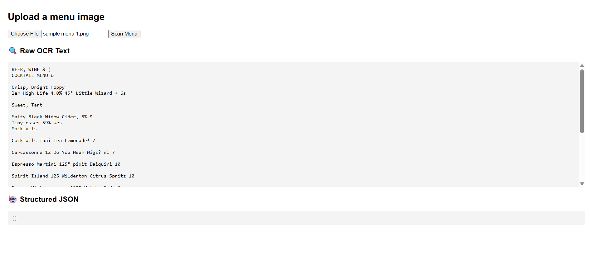

# FoodLens - v1

FoodLens is a project aimed at transforming restaurant menus into interactive digital menus.  
The goal is to let users upload or take a photo of a menu and get a beautiful digital version showing:  
- Menu item names  
- Descriptions  
- Images of dishes  
- Translations and more helpful info  

---

### Current progress (v1):

For now, the app accepts a menu photo, uses OCR to extract the raw text, and displays it.  
This is the foundational step before building structured data extraction and richer features.

---

## Project Structure

```css
FoodLens/v1/
├── backend/
│ ├── app/                  # FastAPI backend source code
│ │  ├── routes
│ │  │   └── extract.py     # extracting text from input menu image
│ │  ├── services
│ │  │   ├── llm.py         # Gemini API code
│ │  │   ├── ocr.py         # Tesseract OCR code
│ │  │   └── utils.py       # storing helper functions (currently empty)
│ │  ├── __init__.py        # currently empty (might be used in future to initialize stuff like env vars for dev/stage/prod)
│ │  └── main.py            # backend entry point
│ ├── venv/                 # Python virtual environment (ignored in Git)
│ ├── requirements.txt      # Backend dependencies
│ └── .env                  # Environment variables (API keys, ignored)
├── frontend/
│ └── index.html            # Simple frontend UI for image upload and results
```

---

## Getting Started

### Prerequisites

- Python 3.8+
- [Tesseract OCR](https://github.com/tesseract-ocr/tesseract) installed and added to your system PATH
- Git (optional, for cloning repo)

---

### Backend Setup

1. Navigate to the backend folder:

   ```bash
   cd FoodLens/v1/backend
   ```

2. Create and activate a virtual environment:
    ```bash
    python -m venv venv
    source venv/Scripts/activate   # Windows Git Bash
    # or
    source venv/bin/activate       # macOS/Linux
    ```

3. Install dependencies:
    ```bash
    pip install -r requirements.txt
    ```

4. Run the FastAPI server:
    ```bash
    uvicorn app.main:app --reload
    ```

### Frontend Setup

Open the ```v1/frontend/index.html``` file in your browser (double-click or open via editor).

Make sure the backend server is running at ```http://localhost:8000```.

## How to Use

1. Open the frontend page in your browser.

2. Upload a photo of a restaurant menu.

3. Click Scan Menu.

4. See the raw OCR text extracted from your image.

## Screenshot

Here is the FoodLens v1 interface after uploading a menu image and extracting text:



*The raw OCR text appears below the upload button once a menu image is scanned.*

## Future Plans

- Integrate Large Language Model (LLM) to parse OCR text into structured menu data.

- Improve frontend UI/UX.

- Add features like menu translation, dish image fetching, and more.

## Contributing

Feel free to fork the repo and open issues or pull requests!