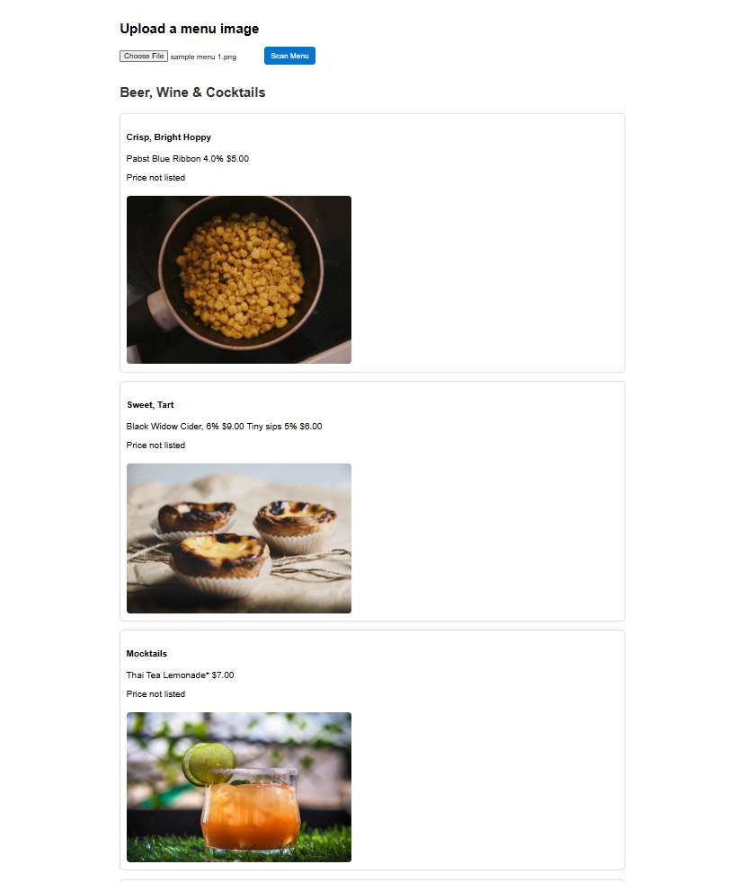

# FoodLens - v1

FoodLens is a project aimed at transforming restaurant menus into interactive digital menus.  
The goal is to let users upload or take a photo of a menu and get a beautiful digital version showing:  
- Menu item names  
- Descriptions  
- Images of dishes  
- Translations and more helpful info  

---

### Current progress (v1):

For now, the app accepts a menu photo, uses OCR to extract the raw text, parses it into structured menu data using an LLM, fetches images for dishes, and displays the full digital menu.  
This is a complete end-to-end MVP from image upload to rich digital menu output.

---

## Project Structure

```css
FoodLens/v1/
├── backend/
│ ├── app/                  # FastAPI backend source code
│ │  ├── routes
│ │  │   └── extract.py     # extracting text from input menu image and calling LLM + image fetch
│ │  ├── services
│ │  │   ├── llm.py         # OpenRouter LLM API code & structured menu extraction
│ │  │   ├── images.py      # Unsplash API code to fetch dish images
│ │  │   ├── ocr.py         # Tesseract OCR code
│ │  │   └── utils.py       # helper functions (currently empty)
│ │  ├── __init__.py        # may be used later for env setup or initialization
│ │  └── main.py            # backend entry point
│ ├── venv/                 # Python virtual environment (ignored in Git)
│ ├── requirements.txt      # Backend dependencies
│ └── .env                  # Environment variables (API keys, ignored)
├── frontend/
│ └── index.html            # Simple frontend UI for image upload and results

```

---

## Getting Started

### Prerequisites

- Python 3.8+
- [Tesseract OCR](https://github.com/tesseract-ocr/tesseract) installed and added to your system PATH
- Git (optional, for cloning repo)
- <b>API keys required:</b>

    - OpenRouter API key (for LLM calls)

    - Unsplash API key (for dish image fetching)

Store these keys securely in a ```.env``` file inside the backend folder:

```env
OPENROUTER_API_KEY=your_openrouter_api_key_here
UNSPLASH_ACCESS_KEY=your_unsplash_access_key_here
```
#### Important: Add ```.env``` to ```.gitignore``` to keep your keys private.


---

### Backend Setup

1. Navigate to the backend folder:

   ```bash
   cd FoodLens/v1/backend
   ```

2. Create and activate a virtual environment:
    ```bash
    python -m venv venv
    source venv/Scripts/activate   # Windows Git Bash
    # or
    source venv/bin/activate       # macOS/Linux
    ```

3. Install dependencies:
    ```bash
    pip install -r requirements.txt
    ```

4. Run the FastAPI server:
    ```bash
    uvicorn app.main:app --reload
    ```

### Frontend Setup

Open the ```v1/frontend/index.html``` file in your browser (double-click or open via editor).

Make sure the backend server is running at ```http://localhost:8000```.

## How to Use

1. Open the frontend page in your browser.

2. Upload a photo of a restaurant menu.

3. Click Scan Menu.

4. View the extracted structured menu with item names, descriptions, prices, and images.

## Screenshot

Here is the FoodLens v1 interface showing the digital menu after uploading and processing a menu image:



---

## Future Plans

- Improve OCR accuracy and parsing

- Add menu translation features

- Enhance frontend UI/UX

- Support more cuisine-specific image fetching and metadata

## Contributing

Feel free to fork the repo and open issues or pull requests!