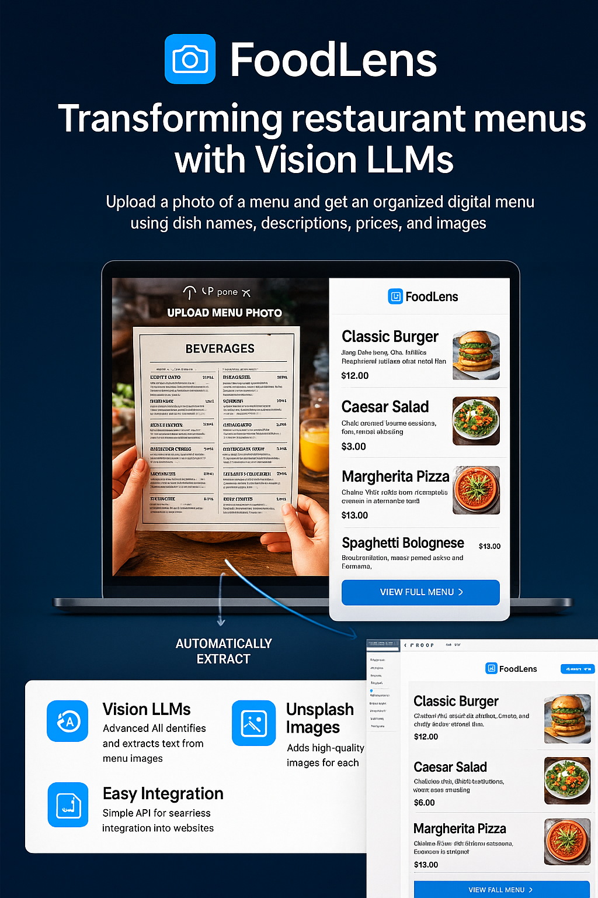

# 🍽️ FoodLens




FoodLens is a web app that turns restaurant menu images into a structured digital menu using Vision LLMs and Unsplash for images. It allows users to upload a menu photo and automatically extract dish names, descriptions, prices, and related images.

## Features

- Upload a menu image via the web app.
- Vision LLM extracts structured menu data (restaurant, categories, items).
- Fetches images for each menu item from Unsplash.
- Fully serverless backend hosted on Vercel — no local dependencies required.
- Responsive frontend using plain HTML, CSS, and JS.

## Live Deployment

**Vercel URL:** [FoodLens Web App](https://food-lens.vercel.app/)

## Project Structure

```plaintext
FoodLens/
├─ v1/
│ ├─ api/ # Python serverless functions
│ │ ├─ __init__.py
│ │ ├─ images.py
│ │ ├─ vision_extract.py
│ │ ├─ vision_response.py
│ │ └─ vision_llm.py
│ ├─ index.html # Frontend
│ ├─ config.js # API base URL config
│ ├─ runtime.txt # Python version
│ └─ requirements.txt # Python dependencies
```


## Environment Variables

Set these on Vercel for proper functionality:

- `OPENROUTER_API_KEY` – API key for Vision LLM.
- `UNSPLASH_API_KEY` – API key for Unsplash image fetching.

## Usage

1. Open the live URL in a browser.
2. Upload a restaurant menu image.
3. Click **Scan Menu**.
4. See the structured menu output including dish names, descriptions, prices, and images.

## Deployment Notes

- Frontend files are in `v1/` (`index.html` + `config.js`).
- Backend routes are in `v1/api/` (Python serverless functions or Flask app).
- API calls use relative `/api/...` endpoints, compatible with any Vercel deployment URL.

## Future Improvements

- Add support for multiple image uploads at once.
- Improve LLM JSON parsing and error handling.
- Add caching for Unsplash images to reduce API calls.
- Implement user authentication for private menu management.

