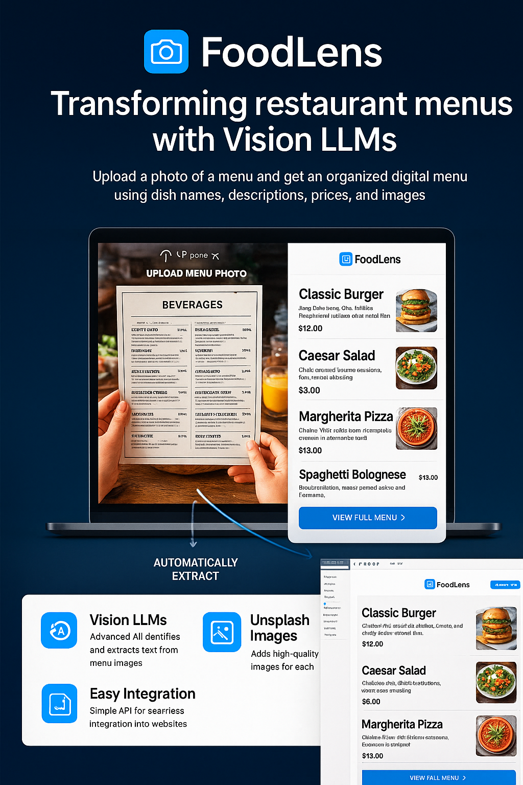

# 🍽️ FoodLens




FoodLens is a web app that turns restaurant menu images into a structured digital menu using Vision LLMs and generated food visuals. It allows users to upload a menu photo and automatically extract dish names, descriptions, prices, and related images.

## Features

- Upload a menu image via the web app.
- Vision LLM extracts structured menu data (restaurant, categories, items).
- Generates menu item images using your Cloudflare Worker image API from the backend.
- Fully serverless backend hosted on Vercel — no local dependencies required.
- Responsive frontend using plain HTML, CSS, and JS.

## Live Deployment

**Vercel URL:** [FoodLens Web App](https://food-lens.vercel.app/)

## Project Structure

```plaintext
FoodLens/
├─ v1/
│ ├─ api/ # Python serverless functions
│ │ ├─ __init__.py
│ │ ├─ images.py
│ │ ├─ vision_extract.py
│ │ ├─ vision_response.py
│ │ └─ vision_llm.py
│ ├─ index.html # Frontend
│ ├─ config.js # API base URL config
│ ├─ runtime.txt # Python version
│ └─ requirements.txt # Python dependencies
```


## Environment Variables

Set these on Vercel for proper functionality:

- `OPENROUTER_API_KEY` – API key for Vision LLM.
- `OPENROUTER_MODEL` *(optional)* – override the OpenRouter model slug used for vision extraction.
- `CLOUDFLARE_IMAGE_API_URL` – your deployed Worker endpoint URL.
- `API_KEY` *(optional)* – Bearer token for your Worker (if enabled).
- `CLOUDFLARE_IMAGE_API_KEY` *(optional, legacy alias)* – also accepted by backend.

## Usage

1. Open the live URL in a browser.
2. Upload a restaurant menu image.
3. Click **Scan Menu**.
4. See the structured menu output including dish names, descriptions, prices, and images.

## Deployment Notes

- Frontend files are in `v1/` (`index.html` + `config.js`).
- Backend routes are in `v1/api/` (Python serverless functions or Flask app).
- API calls use relative `/api/...` endpoints, compatible with any Vercel deployment URL.
- Current backend flow: image → OpenRouter vision extraction → normalized JSON → Cloudflare Worker image generation.
- Current frontend flow: render structured menu with backend-provided `image_url`.

## Local Development (Windows)

`vercel dev` on Windows can fail with `socket.AF_UNIX` due to runtime limitations.

Use Flask directly for local development:

1. Activate your virtual env and install deps:
	- `venv\Scripts\Activate.ps1`
	- `venv\Scripts\python.exe -m pip install -r v1\requirements.txt`
2. Run local app:
	- `cd v1`
	- `..\venv\Scripts\python.exe -m flask --app api.vision_extract run --host 127.0.0.1 --port 5000`
3. Open `http://127.0.0.1:5000`.

Git Bash shortcut (from repo root):

- `bash ./run-local.sh`

Optional custom port:

- `PORT=5050 bash ./run-local.sh`

## Future Improvements

- Add support for multiple image uploads at once.
- Improve LLM JSON parsing and error handling.
- Add caching for Unsplash images to reduce API calls.
- Implement user authentication for private menu management.

